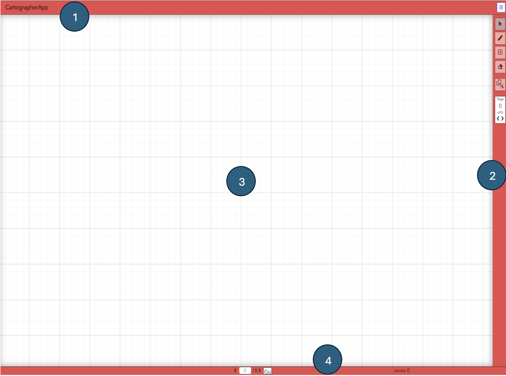
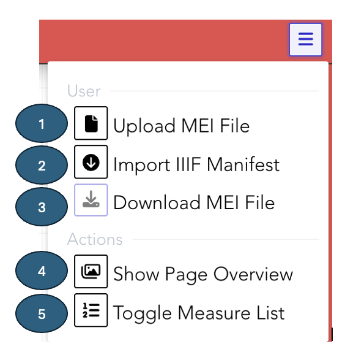

# User Interface

## Window

The Cartographer App window consists of the following parts:

1. **Header (Top Bar)** — contains the title and a dropdown menu button (see number 1 in Image 1).  
2. **Sidebar (Right Panel)** — contains tools for editing and navigation (see number 2 in Image 1).  
3. **Main Working Area** — the central editing space (see number 3 in Image 1).  
4. **Footer (Bottom Bar)** — displays status information about mdivs, page numbers, and zones (see number 4 in Image 1).  

  
*Image 1: Layout of the Cartographer App interface*  

---

## Header

The header contains a **title** (see number 1 in Image 2) and a **dropdown menu button** (see number 2 in Image 2).  

Clicking the menu reveals options for uploading or downloading MEI files, and importing IIIF image files.  
Additionally, the header includes buttons to open the **Page Overview** and toggle the **Measure List**.

  
*Image 2: Layout of the Cartographer App header*  

---

### Menu Bar

Clicking the dropdown menu in the header opens the following options (see Image 3):

1. **Upload MEI File** — upload an MEI file from your local repository (see number 1 in Image 3).  
2. **Import IIIF Manifest** — import an IIIF manifest from a server (see number 2 in Image 3).  
3. **Import Local Image** — import images directly from a folder on your computer (see number 3 in Image 3).  
4. **Download MEI File** — download a rendered MEI file from Cartographer (see number 4 in Image 3).  
5. **Show Page Overview** — display all imported images and add more images (see number 5 in Image 3).  
6. **Toggle Measure List** — show or hide a list of all movements and measures in a sidebar (see number 6 in Image 3).  

  
*Image 3: Header Menu Bar*  

---

## Footer

The footer contains:

1. **Mdiv status display** (see number 1 in Image 9).  
2. **Page navigation buttons** (see number 2 in Image 9).  
3. **Button to jump to a new page** (see number 3 in Image 9).  
4. **Zone counter** — shows the total number of zones on the current page (see number 4 in Image 9).  

  
*Image 9: Cartographer App Footer*  

---

## Sidebar

The sidebar contains the following tools:

1. **Select Regions** — choose and adjust existing regions (see number 1 in Image 10).  
2. **Draw Rectangles** — create new rectangular zones (see number 2 in Image 10).  
3. **Undo** — revert the last change (disabled when there is nothing to undo).  
4. **Redo** — reapply a change that was undone (disabled when there is nothing to redo).  
5. **Add Measures to Zone** — insert additional measures within the same zone (see number 3 in Image 10).  
6. **Erase Measures** — remove selected measures (see number 4 in Image 10).  
7. **Automatic Measure Detection** — run the detector to identify measures automatically (see number 5 in Image 10).  
8. **Page Navigation** — move between pages of the document (see number 6 in Image 10).  

  
*Image 10: The Cartographer App sidebar*  

---

## Keyboard Shortcuts

Editing modes and panels can be toggled with keyboard shortcuts. Shortcuts are
ignored while you are typing in a text field.

| Key | Action |
| --- | --- |
| `s` | Selection mode — select an existing measure |
| `d` | Draw mode — draw a new measure zone |
| `a` | Additional-zone mode — add another zone to the last measure |
| `x` | Deletion mode — delete a measure |
| `m` | Toggle the measure list |
| `p` | Toggle the pages overview |
