# Actions

---

## Importing Images

In the **Cartographer App**, there are two ways to import images:

1. From a local MEI file — the file references images hosted on a IIIF server.  
2. Directly from a IIIF server — by providing the IIIF manifest link.

---

### Importing from a Local MEI File

Click the **menu icon** in the header to open the options.  
Select **"Upload MEI File"** to import an MEI XML file.

- You can load the provided **test dataset** by clicking **"Load Test Data"**.  
- Or click **"Choose File"** to open a file selection dialog and upload your own MEI file.  
- After selecting a file, click **"Load"** to complete the import.  
- To cancel, click **"Cancel"**.

---

#### Step-by-Step

1. Click the **menu button** in the header.  
2. Choose one of the following:  
   - **"Load Test Data"** → imports the sample dataset provided with Cartographer.  
   - **"Choose File"** → opens a dialog to select a file from your computer.  

   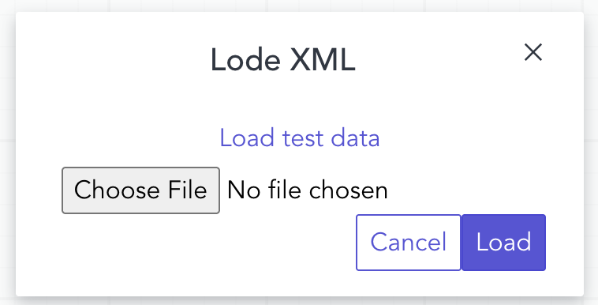  
   *Image 1: Import MEI dialog*  

3. Click **"Load"** to import the file.  
4. (Optional) Click **"Cancel"** to exit without importing.  

---

### Importing Directly from a IIIF Server

Click the **menu icon** in the header to open the options.  
Select **"Import IIIF Manifest"** to import images directly from a IIIF server.

---

When you select **"Import IIIF Manifest"**, a dialog appears:  

- **"Get Test URI"** → load the provided test manifest URI.  
- **"Paste Your URI"** → manually paste your own IIIF manifest URI in the input box.  
- **"Import"** → confirm and load the images.  
- **"Cancel"** → close the dialog without importing.  

---

#### Step-by-Step

1. Click the **menu button** in the header.  
2. Choose one of the following:  
   - **"Get Test URI"** → use the sample manifest provided with Cartographer.  
   - **"Paste Your URI"** → enter your own IIIF manifest URI in the input field.  

   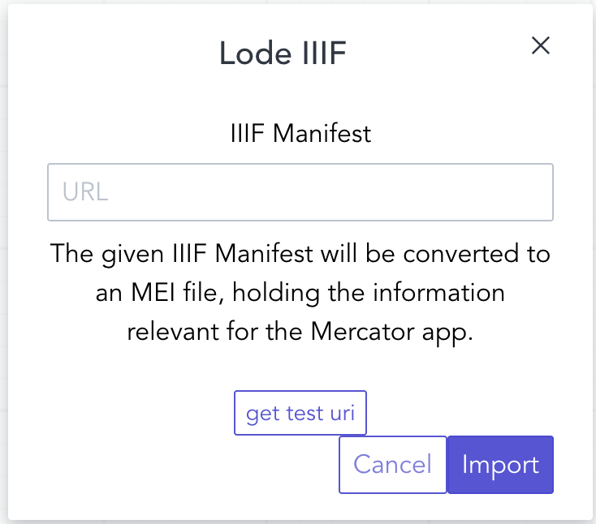  
   *Image 2: Import IIIF Manifest dialog*  

3. Click **"Import"** to load the images.  
4. (Optional) Click **"Cancel"** to close the dialog.  

---

## Download MEI File
Click **"Download MEI File"** in the header menu to save the current MEI file to your local machine.  

---

## Show Page Overview
Click **"Page Overview"** in the header menu to display a list of all pages with detailed information.  
This view also contains a button to copy and paste a IIIF manifest (**"Import Images"**).  

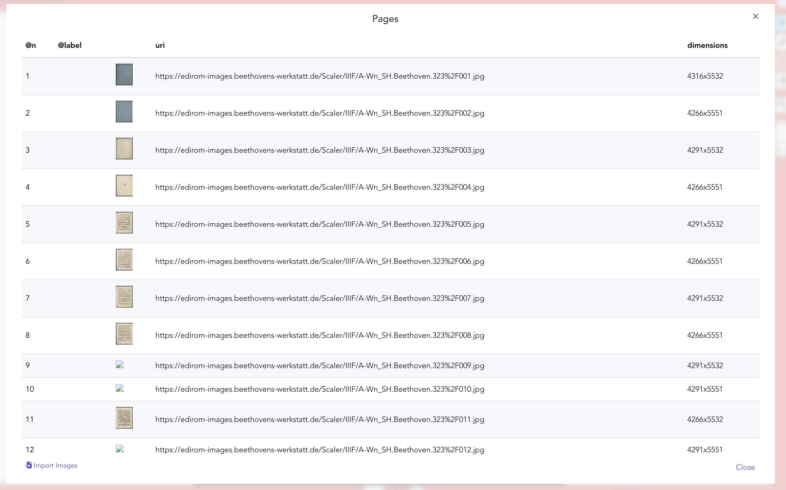  
*Image 3: Page Overview*  

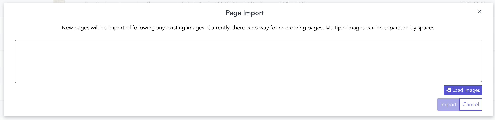  
*Image 4: Import Images*  

---

## Toggle Measure List
Click **"Toggle Measure List"** in the header menu to show or hide the list of musical measures next to the right toolbar.  

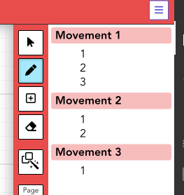  
*Image 5: Toggle Measure List*  

---

## Selecting Regions
Click **"Select"** (pointer icon) to choose and adjust existing regions. (See number 1 in image 6) 
 
---
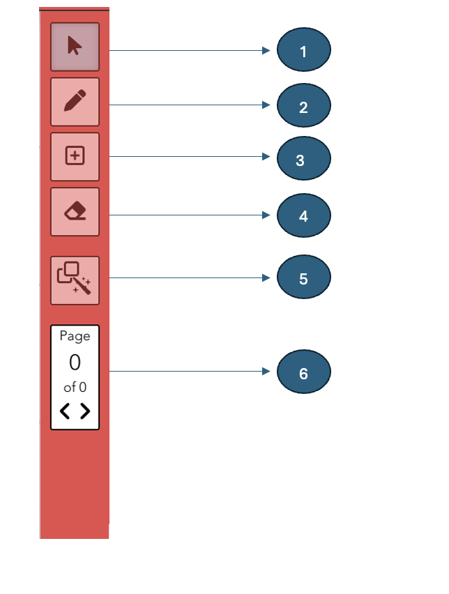 
*Image 6: Menu bar actions*

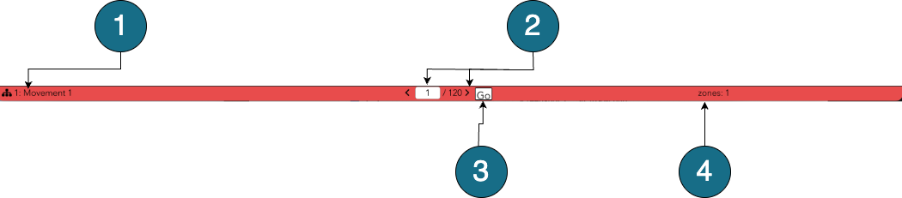 
*Image 7: Footer actions*

## Drawing Measures
Click **"Draw"** (pencil icon) to draw measures.  (See number 2 in image 6) 
Hold the **Shift** key and drag to create the region.  

---

## Adding Multiple Measures
Click **"Add Measures"** to insert additional measures with the same number.  (See number 3 in image 6) 
Hold the **Shift** key and draw the next measure adjacent to the previous one.  
 

---

## Erasing Measures
Click **"Erase"** icon to delete a measure.  
After deletion, don’t forget to deactivate the erase tool.  (See number 4 in image 6) 

---

## Automatic Measure Detection
Click **"Automatic Detection"** to run measure detection on the current page.  (See number 5 in image 6) 

---

## Navigate Through Pages
Use the **"Previous"** and **"Next"** navigation buttons in the sidebar or footer.  (See number 6 in image 6) 
To jump to a specific page, type the page number in the footer’s input box and click **"Go"**.  (See number 3 in image 7) 

---

## Create a New Movement
Double click a measure where you want to start a new movement.  
From the dropdown, select **"new-mdiv"**, then click **"Close"** to confirm.  (See image 8)

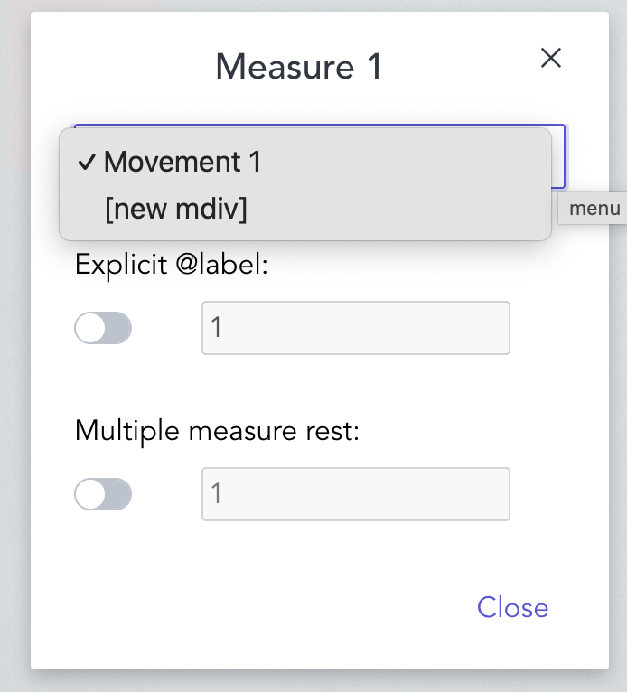
*Image 8: Create New Movement*  

---

## Change Measure Labels
Double click the measure you want to edit.  
Enable **"Explicit @label"**, type the new label, and click **"Close"**.  (See image 9)

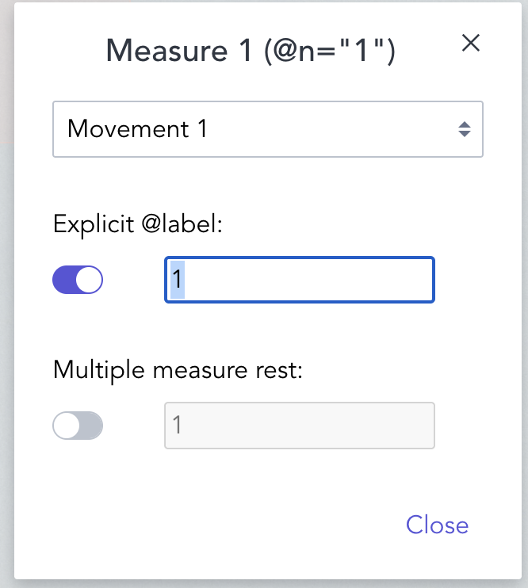 
*Image 9: Change Measure Label*  

---

## Add Multiple Measure Rest
Enable **"Multiple Measure Rest"**.  
Enter the number of measures in the input box, then click **"Close"**.  (See image 10)

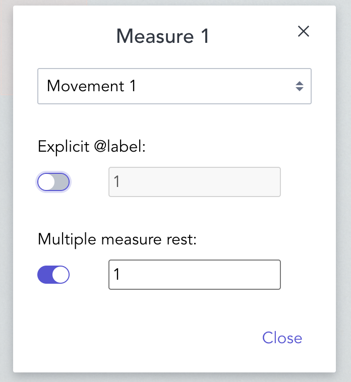
*Image 10: Multiple Measure Rest*

---

## Change Movement Label
Click the **"Movement"** button in the lower left corner of the footer.  (See number 1 in Image 7)
Edit the movement name in the input box.  (See Image 11)
When finished, click **"Close"**.  

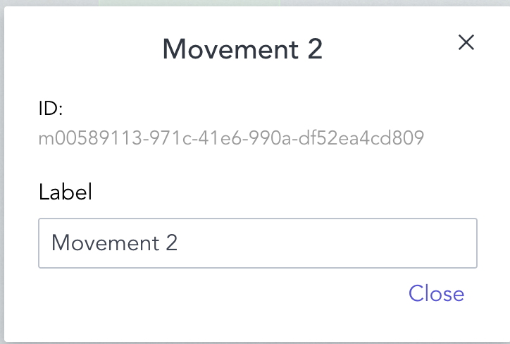
*Image 11: Change Movement Label*  

## Change Movement

To change the movement of a measure, double-click on the measure you want to edit.  
A new window will appear (see Image 12).  

From this window, choose the movement to which the selected measure should belong.  
- If the current movement is **before** the new one, the measure and all following measures will be reassigned.  
- If the current movement is **after** the new one, the measure and all previous measures will be reassigned.  

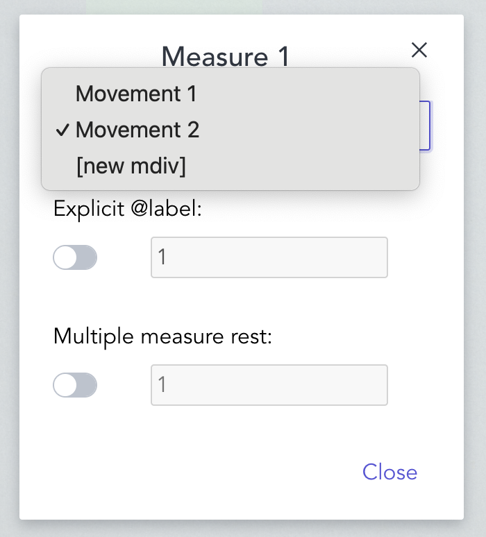  
*Image 12: Change Movement Window*  
