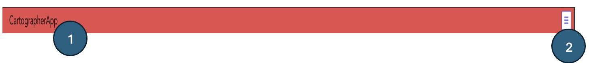
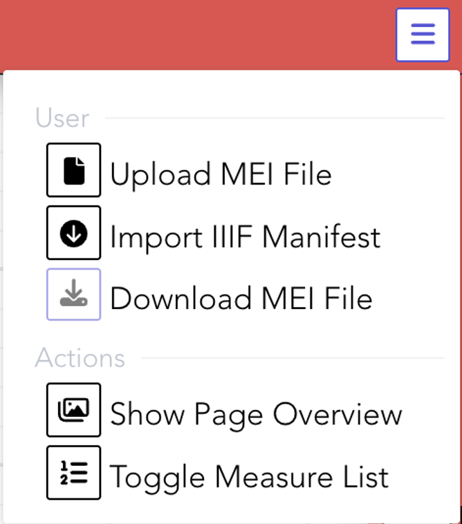
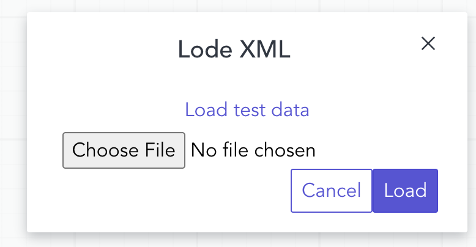
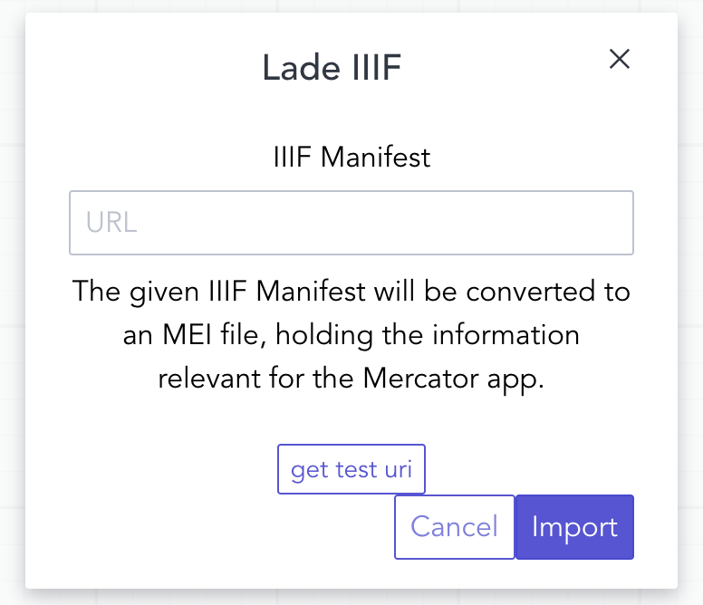

# Header

In the Cartographer App, the header contains a title (see number 1 in Image 2) and a dropdown menu button (see number 2 in Image 2).  

Clicking the menu reveals buttons for uploading or downloading MEI files, and for loading IIIF image files from a server.  
Additionally, the header includes buttons to show the **Page Overview** and to toggle the **Measure List**.

  
*Image 2: Layout of the Cartographer App header*

---

## Menu Bar

Clicking the dropdown menu in the header opens five options (see Image 3):

  
*Image 3: Header Menu Bar*

### Upload MEI File
Opens a file dialog where you can select and upload a local MEI file.  

  
*Image 4: Upload MEI file*

### Import IIIF Manifest
Opens a dialog to enter the URL of a IIIF manifest to load image data from a server.  

  
*Image 5: Import IIIF manifest*

### Download MEI File
Saves the current MEI file to your local machine.

### Show Page Overview
Displays a list of all pages with detailed information from an imported file (see figure 6).  
It also contains a button to copy and paste a IIIF manifest (*Import Images button*, figure 7).

  
*Image 6: Display list of images*

  
*Image 7: Import Images*

### Toggle Measure List
Shows or hides the list of musical measures of the document next to the right toolbar.

  
*Image 8: Toggle Measures*
